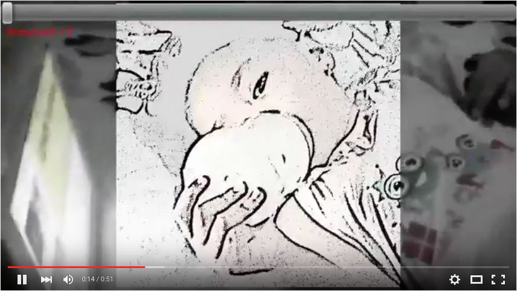

# Adaptive Thresholding Android

adaptivethreshold-melvincabatuan created by Classroom for GitHub

## Warning

 Note the Gradle plugin is at the experimental stage. The Gradle API for the new component model is not final, which means it'll only work with a specific version of Gradle until the APIs are final.

For issues, refer to:

(http://tools.android.com/tech-docs/new-build-system/gradle-experimental)

## Pre-requisites
--------------
- Android Studio 1.3+ with [NDK](https://developer.android.com/ndk/) bundle.
- [OpenCV](http://opencv.org)

## Keypoints:

'gradle-wrapper.propertie' uses 'gradle-2.5'. (Only gradle-2.5 works in the current release for external library...)
```gradle
#Sun Nov 15 20:02:55 PHT 2015
distributionBase=GRADLE_USER_HOME
distributionPath=wrapper/dists
zipStoreBase=GRADLE_USER_HOME
zipStorePath=wrapper/dists
distributionUrl=https\://services.gradle.org/distributions/gradle-2.5-all.zip
```

Project's 'build.gradle' uses 'gradle-experimental:0.2.0'. 
```gradle
// Top-level build file where you can add configuration options common to all sub-projects/modules.

buildscript {
    repositories {
        jcenter()
    }
    dependencies {
        classpath 'com.android.tools.build:gradle-experimental:0.2.0'

        // NOTE: Do not place your application dependencies here; they belong
        // in the individual module build.gradle files
    }
}

allprojects {
    repositories {
        jcenter()
    }
}

task clean(type: Delete) {
    delete rootProject.buildDir
}
```

App's 'build.gradle'
```gradle
apply plugin: 'com.android.model.application'

model {
    android {
        compileSdkVersion = 23
        buildToolsVersion = "23.0.2"

        defaultConfig.with {
            applicationId = "ph.edu.dlsu.adaptive"
            minSdkVersion.apiLevel = 15
            targetSdkVersion.apiLevel = 23
            versionCode = 1
            versionName = "1.0"
        }
    }
    android.buildTypes {
        debug {
            ndk.with {
                debuggable = true
            }
        }
        release {
            minifyEnabled = false
            proguardFiles += file('proguard-rules.pro')
        }
    }

    compileOptions.with {
        sourceCompatibility=JavaVersion.VERSION_1_7
        targetCompatibility=JavaVersion.VERSION_1_7
    }

    android.ndk {

        moduleName = "native_opencv_module"

        cppFlags += "-Werror"
        cppFlags += "--debug"
        cppFlags += "-frtti"
        cppFlags += "-fexceptions"
        cppFlags += "-I${file('/home/cobalt/Android/OpenCV-android-sdk/sdk/native/jni/include')}".toString()
        cppFlags += "-I${file('src/main/jni')}".toString()

        ldLibs += ["android", "log", "stdc++", "dl", "jnigraphics", "z"]
        stl = "gnustl_static"
    }

    android.productFlavors {
        create("arm") {
            ndk.with {
                abiFilters += "armeabi"

                File curDir = file('./')
                curDir = file(curDir.absolutePath)
                ldLibs += curDir.absolutePath + "/src/main/jniLibs/" + "armeabi" + "/libopencv_java3.so"
            }
        }
        create("arm7") {
            ndk.with {
                abiFilters += "armeabi-v7a"

                File curDir = file('./')
                curDir = file(curDir.absolutePath)
                ldLibs += curDir.absolutePath + "/src/main/jniLibs/" + "armeabi-v7a" + "/libopencv_java3.so"
            }
        }
        create("arm8") {
            ndk.with {
                abiFilters += "arm64-v8a"

                File curDir = file('./')
                curDir = file(curDir.absolutePath)
                ldLibs += curDir.absolutePath + "/src/main/jniLibs/" + "arm64-v8a" + "/libopencv_java3.so"
            }
        }
        create("x86") {
            ndk.with {
                abiFilters += "x86"

                File curDir = file('./')
                curDir = file(curDir.absolutePath)
                ldLibs += curDir.absolutePath + "/src/main/jniLibs/" + "x86" + "/libopencv_java3.so"
            }
        }
        create("x86-64") {
            ndk.with {
                abiFilters += "x86_64"

                File curDir = file('./')
                curDir = file(curDir.absolutePath)
                ldLibs += curDir.absolutePath + "/src/main/jniLibs/" + "x86-64" + "/libopencv_java3.so"
            }
        }
        create("mips") {
            ndk.with {
                abiFilters += "mips"

                File curDir = file('./')
                curDir = file(curDir.absolutePath)
                ldLibs += curDir.absolutePath + "/src/main/jniLibs/" + "mips" + "/libopencv_java3.so"
            }
        }
        create("mips-64") {
            ndk.with {
                abiFilters += "mips64"

                File curDir = file('./')
                curDir = file(curDir.absolutePath)
                ldLibs += curDir.absolutePath + "/src/main/jniLibs/" + "mips64" + "/libopencv_java3.so"
            }
        }
    }
}

dependencies {
    compile fileTree(dir: 'libs', include: ['*.jar'])
}
```

## Accept

To accept the assignment, click the following URL:


## Sample Solution:

https://github.com/DeLaSalleUniversity-Manila/adaptivethreshold-melvincabatuan

## Submission Procedure with Git: 

```shell
$ cd /path/to/your/android/app/
$ git init
$ git add –all
$ git commit -m "your message, e.x. Assignment 1 submission"
$ git remote add origin <Assignment link copied from assignment github, e.x. https://github.com/DeLaSalleUniversity-Manila/secondactivityassignment-melvincabatuan.git>
$ git push -u origin master
<then Enter Username and Password>
```

## Videocapture:

[](https://youtu.be/9PIN2xaOcM8)

"*Everyone knows that debugging is twice as hard as writing a program in the first place. So if you are as clever as you can be when you write it, how will you ever debug it?*" -  Brian Kernighan
